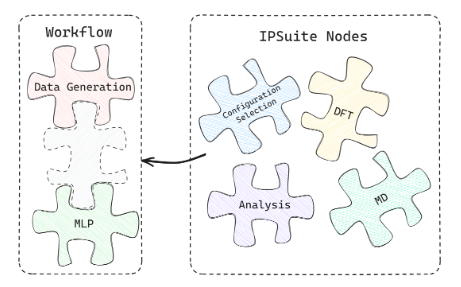

What Is IPSuite?
================

.. image:: https://raw.githubusercontent.com/zincware/IPSuite/main/misc/IPS_logo.png
    :width: 800
    :alt: IPS Logo

Description
-----------

IPS (or Interatomic Potentials Suite) is a tool for working with Machine Learned Interatomic Potentials 
and construcing computational workflows which are executed at a later time.
Using `DVC <https://dvc.org/>`_ as its backbone, IPS allows efficent and transparent data versioning of complex datasets.
IPS is designed to simplify the creation of *Machine Learned Potentials*  (MLPs) by providing an interface for many established MLP packages.  

A Project is construced using modular components to build the desired workflow.
Each modlule (kown in the IPS environment as Node), takes some inputs and provieds outputs. These outputs can then be redirected to other Nodes.
Sort of like a Jigsaw multiple Nodes can be connected together in order to create complex data-flow structures.

IPSuite already provides various Nodes in order to meet the needs of MPL creation and training. 