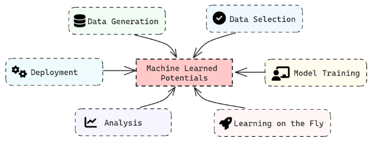

What Is IPSuite?
================

.. image:: https://raw.githubusercontent.com/zincware/IPSuite/main/misc/IPS_logo.png
    :width: 800
    :alt: IPS Logo

Description
-----------

IPS (or Interatomic Potentials Suite) is a tool for working with Machine Learned Interatomic Potentials
and constructing computational workflows which are executed at a later time.
It is based on `ZnTrack <https://github.com/zincware/ZnTrack/>`_ and thus allows for fully version controlled and reproducible workflows.
Within IPS, we provide numerous Nodes for creating atomistic data, training models, analyzing predictions and performing molecular dynamics.

Using `DVC <https://dvc.org/>`_ as its backbone, IPS allows efficient and transparent data versioning of complex datasets.
IPS is designed to simplify the creation of *Machine Learned Potentials*  (MLPs) by providing an interface for many established MLP packages.

A Project is constructed using modular components to build the desired workflow.
IPSuite partitions these workflows into so called nodes, each dedicated for one specific task.
Sort of like a Jigsaw multiple nodes can be connected together in order to create complex data-flow structures.

.. figure:: ../images/jigsaw_nodes.png
    :alt: Nodes Jigsaw

IPSuite provides various Nodes in order to meet the needs of MPL creation and training.

