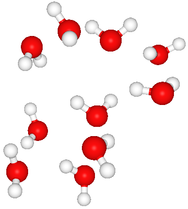

.. _getting_started:

Getting started
===============

Installation
------------

The IPS package can be downloaded via the package-management system pip.
We recommend the usage of an python environment with the python version 3.10. Other versions might not currently work.

.. code-block:: bash

    pip install ipsuite

Alternatively the latest version of IPSuite can be downloaded from `GitHub <https://github.com/zincware/IPSuite>`_,
using `Poetry <https://python-poetry.org/>`_ to install the python dependencies.

.. code-block:: bash

    git clone https://github.com/zincware/IPSuite.git
    cd IPSuite
    poetry install

For IPSuite to work, it is necessary for an IPS Project to be in a git as well as DVC initialized directory.
Create a folder for your project and initialize git and DVC to start working with IPS.

.. code-block:: bash

    mkdir project
    cd project
    git init
    dvc init

In a file :code:`main.py` try importing IPS to check if everything is working correctly

.. code-block:: python

    import ipsuite as ips

To get to know the IPS procedures we will do an example problem.

The First Project
=================

Initial Data Generation
-----------------------
This project will show the basic creation of an IPS Project using an additional piece of software
called `Packmol <https://m3g.github.io/packmol/>`_.
The goal is to place water molecules inside a box at a specified density.

.. code-block:: python

    import ipsuite as ips

    with ips.Project() as project:
        # Generate a single water molecule
        mol = ips.SmilesToAtoms(smiles="O")
        # Duplicate water molecules
        packmol = ips.Packmol(
            data=[mol.atoms], count=[10], density=876
            )

    project.build()

The *SmilesToAtoms* node takes the `SMILES <https://en.wikipedia.org/wiki/Simplified_molecular-input_line-entry_system>`_ string for water ("O"),
and generates an an `ASE atoms object <https://wiki.fysik.dtu.dk/ase/ase/atoms.html>`_ from it.
This atom from the SmilesToAtoms instance can be accessd by calling `mol.atoms`.
This instance attribute is then handed over to the Packmol node in the `data` attribute.
It is possible to hand over multiple different types of ASE atoms,
so `mol.atoms` as to be given as a list. The next attribute we need to set is the amount of molecules we want to place in the box.
This also has to be a list with each entry being the amount for other ASE atoms object in the `data` list. Lastly the density has
to be provided. Calling `project.build()` will save the workflow into DVC graph configuration and parameter files.
After executing the code, the entire workflow is constructed and can be visualised
by running `dvc dag`, which shows the graph of the workflow. Using the option `dvc dag --mermaid` will return a flowchart, which can be
used with `Mermaid <https://mermaid.js.org/>`_ to better visualise the workflows.

The parameters files, namely `params.yaml` can be viewed and parameters can be changed without rerunning the python script.

By calling `dvc repro` the workflow consisting of the nodes is executed, which results in the generation of firstly a single water molecule by the SmilesToAtoms node and then the placement
of multiple water molecules in a box by the Packmol node.
After running `dvc repro` a new folder `nodes` is created which each node having their own subfolder. These folders
contain the results from the Nodes.

Using the closely to IPSuite related software `ZnDraw <https://github.com/zincware/ZnDraw>`_, which can be installed via `pip install zndraw`,
we can visualise the H5MD files generated by the nodes.

.. code-block:: bash

    zndraw nodes/SmilesToAtoms/structures.h5

will visualise the single water molecule generated by SmilesToAtoms. There will also be a H5MD file in the Packmol folder

    Screenshot of the ZnDraw visualistion of the Watermoluclas generated by packmol.

Now that the workflow has been created, we can change all parameters in the `params.yaml` at will and run `dvc repro` to
execute the nodes with the new parameters. If `dvc repro` is run again without changing any parameters, no node will be
executed, but the data from the cache will be loaded.

Creating Experiments
--------------------

Nodes
-----

Creating Nodes
--------------
